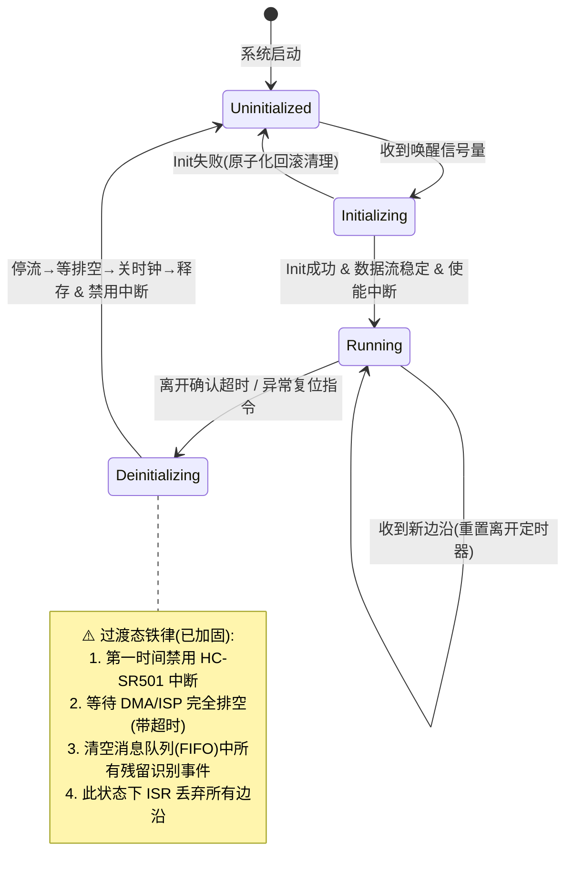
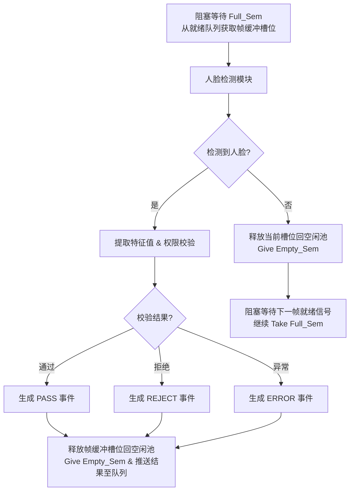
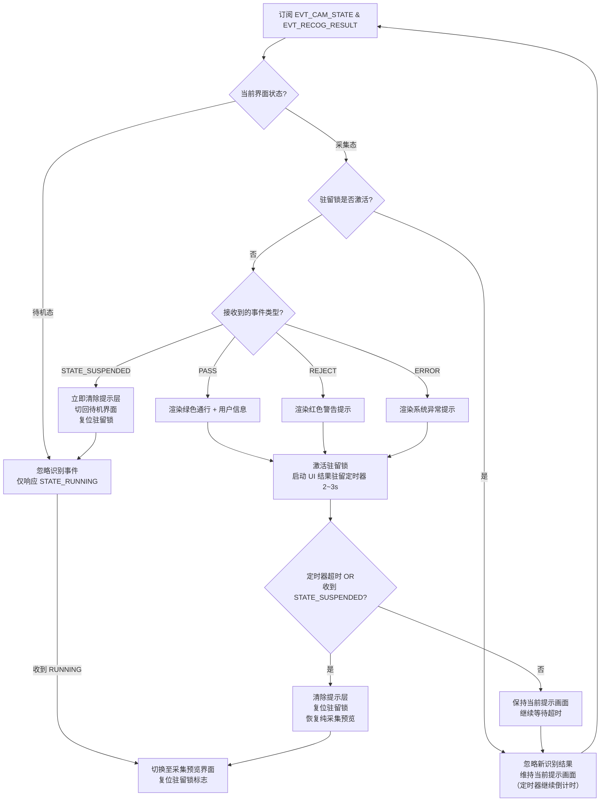

# 开发手册

> 本手册面向 `software_engineering/firmware` 固件工程，描述分层架构下各层的开发范式、目录约定与关键约束。
> **实现状态约定**：🟢 已实现　🟡 规划中（目录已建，代码待补）　⚪ 未启动

## 1. 固件开发

### 1.1 工程总览与目录结构

### 1.3 BSP 层开发 🟢

#### 1.4 DAL 层开发 🟢


#### 1.4.1 三件套结构

> 
>

#### 1.4.2 公共基础设施

#### 1.4.3 新增设备 DAL 流程

---

### 1.5 Middleware 层开发 🟡

Middleware 是与具体硬件无关的通用组件层，可被 Service 复用。位于 DAL 之上、业务逻辑之下。当前为桩目录，尚未实现。

#### 1.5.1 buffer_pool（规划）

- **职责**：提供计数型环形帧缓冲池，支撑采集→识别的零拷贝流水线。

  

#### 1.5.2 storage_db

---

### 1.6 业务（Service）层开发 🟡

业务层位于 `main/service/`，当前四个子目录均为桩，尚未实现。`main.c` 现仅执行 `bsp_v1_init()` + `bsp_v1_selftest()` + 空闲循环，未创建任何业务任务（全工程唯一任务是 BSP 内部的 `pir` 任务）。

#### 1.6.1 任务划分（规划）

下表为规划任务及实现状态：

| 任务 | 类别 | 规划优先级 | 状态 |
| ---- | ---- | ---------- | ---- |
| 摄像数据采集任务 | 核心 | 最高 | svc_camera |
| 人脸检测任务 | 核心 | 高 | svc_face_detect |
| 人脸特征提取任务 | 核心 | 高 | svc_face_feature |
| 人员权限管理任务 | 核心 | 中 | svc_perm_manager |
| UI 显示任务 | 交互 | 中 | svc_ui |
| Touch 坐标获取任务 | 交互 | 中高 | svc_touch |
| 日志管理任务 | 底层 | 最低 | svc_log |
| 系统稳定性保障任务 | 底层 | 高 | svc_wdt |
| MQTT 任务 | 通信 | 中低 | svc_mqtt |
| ota任务 |  |  | svc_ota |

**底层基础业务划分：**

* **数据库管理中间件**
  - **职责**：封装 SQLite/KV 存储引擎，提供线程安全的 CRUD 接口；管理 Flash 磨损均衡与掉电安全（WAL/双备份）；维护人员特征库、通行记录、系统配置的持久化。
  - **关键点**：作为独立服务运行，对外暴露语义化 API（如 `person_add()`, `record_query()`），**严禁**其他任务直接调用 `fopen/sqlite3_exec`。内部使用 Mutex + 消息队列串行化写操作，避免多任务竞争。
  - **优先级**：中低（避免阻塞识别主流程）。

* **日志管理任务**
  - **职责**：异步收集各模块日志，执行 RAM Buffer 环形缓存 + 批量落盘策略；支持日志分级过滤与远程上传队列。
  - **关键点**：采用**生产者-消费者模型**，业务层仅做非阻塞 `log_push()`，由本任务负责刷盘。防止 SD 卡/Flash 写入抖动影响人脸检测实时性。
  - **优先级**：最低（可被所有业务抢占）。

* **系统稳定性保障任务**
  - **职责**：硬件看门狗喂狗、任务心跳监测、内存/存储水位告警、异常状态自动恢复（如摄像头掉线重连、MQTT 断线重连）、OTA 状态机管理。
  - **关键点**：作为系统的“保险丝”，必须独立于核心业务。检测到关键任务超时未上报心跳时，执行分级复位策略。
  - **优先级**：高（确保监控不被业务卡死）。

**交互业务划分：**

- **UI 显示任务**
  - **职责**：LVGL 框架渲染、界面状态机切换、摄像数据显示、识别结果反馈动画、离线/在线状态指示。
  - **关键点**：与 Touch 任务解耦，通过消息队列接收事件。帧率控制在 30fps 即可，避免过度占用 GPU/CPU。经 `dal_display_get("main_lcd")` 取屏，`dal_touch_get("main_touch")` 取触摸。
  - **优先级**：中（保证用户交互流畅，但低于识别）。
- **Touch 坐标获取任务**
  - **职责**：触摸 IC 轮询或中断读取、坐标滤波去抖、手势识别、向 UI 任务发送标准化输入事件。
  - **关键点**：采样率 ≥ 60Hz，避免抖动误触。
  - **优先级**：中高（输入响应延迟 < 50ms）。

**核心业务划分：**

- **摄像数据采集任务**
  - **职责**：MIPI/DVP Camera 驱动管理、ISP 参数动态调整（宽动态/降噪）、计数型缓冲池管理、向 UI 显示任务与人脸检测任务零拷贝送帧。经 `dal_camera_get("main_cam")` 取设备。
  - **关键点**：使用 **DMA + 双/三缓冲**，杜绝丢帧。曝光/增益调节需与识别算法联动（如逆光场景自动切换 HDR）。
  - **优先级**：最高（数据源头，阻塞则全链路瘫痪）。
- **人脸检测任务**
  - **职责**：从帧缓冲取图、预处理（Resize/归一化）、运行检测模型、输出人脸框坐标与质量分。
  - **关键点**：绑定 NPU/DSP 加速单元；设置**质量阈值**过滤低质帧，减少后续无效计算；支持多尺度检测适配不同距离。
  - **优先级**：高（实时性瓶颈所在）。
- **人脸特征提取任务**
  - **职责**：对检测到的人脸裁剪对齐、运行特征提取模型、生成 512D/256D 特征向量。
  - **关键点**：与检测任务可**流水线并行**（检测第 N+1 帧时提取第 N 帧特征）；特征向量存入共享内存供识别任务使用。
  - **优先级**：高（与检测同级的计算密集任务）。
- **人员权限管理任务**
  - **核心职责**：作为 APP 层处理“人员是否允许开门”的唯一业务入口与领域聚合根，还需要更具人脸特征进行1:N比对。
    - **用户 CRUD**：统一管理用户、人脸、权限的生命周期，保证数据事务一致性。
    - **人脸录入**：封装“采集→质检→提取→入库”完整流程，调度 AI 能力并把控底库质量。
    - **单帧识别**：对外提供 `recognize_single()` 接口，封装 1:1/M:N 等模式，屏蔽底层 AI 差异。
    - **权限校验与决策**：接收实时识别结果或外部验证请求，结合时段、区域、黑名单等规则进行鉴权，**输出最终的开门/拒绝/报警决策**。开门信号经 `dal_relay_get("door_lock")` 输出。
  - **关键工程约束**：
    - **纯业务逻辑任务**，不涉及 AI 模型推理计算。
    - 内部维护 RAM 权限缓存，CRUD 操作时同步更新，确保鉴权 O(1) 响应。
    - 开门信号输出前执行硬件级防抖与状态机校验。
    - 权限变更通过消息广播，无需重启识别流水线。
    - **MQTT 下行指令的唯一消费者**：负责解析云端透传的用户管理/远程开门 Payload，并执行验签、业务校验与落盘。
  - **优先级**：**中**。允许 10~50ms 决策延迟，但不能阻塞识别流水线与 UI 交互。
- **MQTT 任务**
  - **核心职责**：设备与云端交互的**纯通信管道**。负责连接生命周期管理、事件上报透传、远程命令路由分发、离线缓存补传。**绝不解析任何业务语义**。
  - **关键工程约束**：
    - **连接管理**：TLS 双向认证、心跳保活、断线重连（指数退避+随机抖动），重连异步执行不阻塞本地业务。
    - **消息路由**：下行指令按 Topic 前缀原样投递至对应业务任务（如 `cmd/user` → 人员权限管理任务），不做任何字段解析。
    - **QoS 分级**：心跳 QoS0；通行记录/告警/开门指令 QoS1；底库全量同步 QoS2。
    - **离线保障**：断网时关键事件写入 RAM RingBuffer / Flash 日志，写入零阻塞；联网后按优先级限流补传，携带全局唯一 `msg_id` 防重。
    - **本地隔离**：网络 IO 与业务逻辑完全解耦，网络异常时自动降级，确保本地识别与开门决策零影响。
  - **优先级**：**中低**。网络波动与重连不应影响本地识别与开门决策。

#### 1.6.2 任务开发决策

| 决策维度         | 推荐方案                               | 备选/不推荐           | 核心理由                                                     |
| ---------------- | -------------------------------------- | --------------------- | ------------------------------------------------------------ |
| IPC 机制         | 消息队列（控制流）+ 共享内存（数据流） | 全局变量 / Socket     | 控制指令需有序可靠；图像/特征向量体积大，必须零拷贝避免 CPU 搬运开销。 |
| 任务调度模型     | 事件驱动 + 状态机                      | 裸循环轮询 / 阻塞等待 | 降低空闲功耗；避免单任务阻塞导致系统假死；适配多源异步输入（触摸、网络、AI 结果）。 |
| 内存管理策略     | 静态分配 + 内存池                      | 动态 `malloc/free`    | 嵌入式长期运行严禁内存碎片；AI 帧缓冲、MQTT 离线缓存等大块内存启动时预分配。 |
| 错误处理范式     | 错误码 + 分级恢复                      | 断言 / 直接重启       | 非致命错误（如单次识别超时）重试或降级；致命错误（如 Flash 损坏）才触发看门狗复位。 |
| 配置持久化       | KV 存储（参数）+ SQLite（业务数据）    | 纯文件 / 纯数据库     | 系统参数读写频繁且体积小，KV 磨损均衡更优；人员/记录等结构化数据用 SQLite 保证事务一致性。 |
| AI 推理调度      | NPU 独占 + 异步回调                    | CPU 软推理 / 同步阻塞 | NPU 硬件加速是实时性前提；异步回调释放 CPU 给其他任务做预处理/后处理，实现流水线并行。 |
| 跨任务数据所有权 | 单一 Owner + 只读共享                  | 多任务可写            | 权限缓存仅“人员权限管理任务”可写，其他任务只读；杜绝竞态条件与脏数据。 |

#### 1.6.3 关键流程图 / 时序图 / 数据流图

* 实时识别-决策-执行数据流

```
[Camera] ──DMA──▶ [帧缓冲(Ring)] 
                      │
          ┌───────────┴───────────┐
          ▼                       ▼
[人脸检测(NPU)]            [UI显示(30fps)]
          │
          ▼ (人脸框+质量分)
[特征提取(NPU)] ──共享内存──▶ [人脸识别(ANN比对)]
                                      │
                                      ▼ (PersonID+置信度)
                              [人员权限管理] ◀── [RAM权限缓存]
                                      │
                              ┌───────┴───────┐
                              ▼               ▼
                        [IO执行(开门)]   [MQTT(事件上报)]
                        (防抖+状态机)    (异步透传,零解析)
```

> **数据流关键点**：
>
> - 图像数据全程 DMA + 零拷贝，CPU 仅传递元数据（坐标、指针、长度）。
> - 识别结果到权限决策为进程内消息队列传递，延迟 <1ms。
> - MQTT 仅接收“已组装好的事件报文”，不参与任何业务字段拼接。

* 云端远程开门指令时序

```
Cloud        MQTT任务         人员权限管理任务      IO执行任务       DB任务
  │              │                  │                 │              │
  │─cmd/user(QoS1)─▶│               │                 │              │
  │              │─原样Payload投递─▶  │                 │              │
  │              │                  │─验签+解析JSON     │              │
  │              │                  │─查RAM权限缓存     │              │
  │              │                  │─生成开门决策      │              │
  │              │                  │──开门信号(防抖)──▶│              │
  │              │                  │                 │─驱动继电器   │
  │              │                  │──记录通行事件──────────────────▶ │
  │              │                  │                 │            │─异步落盘
  │              │◀─ACK(QoS1)────── │                 │              │
  │◀─PUBACK──────│                  │                 │              │
```

> **时序关键点**：
>
> - MQTT 任务从收到消息到投递耗时 <5ms，不做任何业务处理。
> - 人员权限管理任务是唯一解析 Payload、校验权限、输出决策的节点。
> - DB 写入完全异步，不在开门关键路径上，确保端到端延迟可控。

* 系统架构图（LR）

  **核心机制**：

  - **空闲信号量（Empty Sem）**：计数 = N（总池大小），表示空闲可用的 Buffer 数量。
  - **就绪信号量（Full Sem）**：计数 = 0，表示已填充好、待识别的帧数量。
  - **采集任务**：阻塞 `Take` 空闲信号量 → 填充帧 → `Give` 就绪信号量。
  - **识别任务**：阻塞 `Take` 就绪信号量 → 拷贝 ROI/识别 → `Give` 空闲信号量（归还）。

```mermaid
flowchart LR
    subgraph Hardware_Interrupt [硬件中断层]
        A[HC-SR501 上升沿 ISR] -->|仅发信号量| B(采集任务)
    end

    subgraph Task_Layer [RTOS 任务层]
        B -->|状态变更事件 EVT_CAM_STATE| C{状态广播}
        
        B -->|1. Take(Empty_Sem) 获取空闲槽<br/>2. 写入帧数据<br/>3. Give(Full_Sem) 递送就绪帧| D[识别任务]
        
        C -->|STATE_RUNNING / SUSPENDED| E[UI 显示服务]
        D -->|识别结果事件 EVT_RECOG_RESULT| F[消息队列]
        F -->|PASS / REJECT / ERROR| E
    end

    subgraph Resource_Layer [资源管理层]
        G[(计数型环形帧缓冲池<br/>总容量 N 槽位)]
        H[Empty_Sem 空闲计数=N<br/>Full_Sem 就绪计数=0] -.->|驱动采集与识别同步| B
        H -.->|驱动采集与识别同步| D
        I[外设驱动 API] -.->|Init/Deinit| B
    end
    
    style Hardware_Interrupt fill:#ffe0b2,stroke:#f57c00
    style Task_Layer fill:#e1f5fe,stroke:#0288d1
    style Resource_Layer fill:#f3e5f5,stroke:#7b1fa2
```

* 设备状态机（StateDiagram）



* 识别流水线（TD）



* UI 显示服务（TD）

  **优化点**：引入 **“结果驻留锁（Holding Lock）”**。在 2~3s 驻留期间，新来的识别结果**不再重置定时器**（仅静默更新后台数据或直接丢弃），定时器超时后自动释放锁，彻底解决高并发人流下提示层无法清除的顽疾。



#### 1.6.4 中断管理

| 中断源            | 优先级 | 处理策略                                                     | 禁止事项                                                     | 关联任务              |
| ----------------- | ------ | ------------------------------------------------------------ | ------------------------------------------------------------ | --------------------- |
| HC-SR501 OUT 引脚 | 中高   | 上升沿： ① 若采集任务处于挂起态 → 唤醒任务启动采集； ② 若离开确认定时器正在运行 → 立即取消定时器，保持采集运行； 下降沿： 启动/重置“离开确认定时器”（默认 5~10s），不直接挂起任务； ISR 仅做边沿到动作的映射，不传递数据、不记录时间戳 | 禁止在 ISR 中做去抖、延时、内存操作、日志打印、向 UI/权限任务发送事件、控制屏幕背光、直接挂起任务 | 摄像数据采集任务      |
| Timer Tick        | 系统级 | 仅更新系统时基、喂软件看门狗计数器                           | 禁止绑定任何业务逻辑                                         | OSAL / 稳定性保障任务 |

> ℹ️ 当前已实现的 PIR ISR（`bsp_pir_hcsr501.c`）遵循此铁律：ISR 仅 `xQueueSendFromISR`，去抖与回调在 `pir_task` 任务上下文完成。

##### ⚠️ 中断设计铁律

1. **ISR 只做“搬运工”和“信号员”**：所有中断服务程序执行时间必须 <10μs（Camera/NPU 等高频中断 <5μs），复杂逻辑一律推迟到任务上下文。
2. **共享数据保护**：ISR 与任务共享的变量必须用 `volatile` 修饰；多字节数据使用原子操作或关中断保护，禁用 Mutex（ISR 中不可阻塞）。
3. **中断嵌套管控**：仅允许 Camera VSYNC 抢占 NPU 完成中断；其余中断同级不嵌套，避免栈溢出与优先级反转。
4. **异常隔离**：外设中断异常（如 UART 溢出、DMA 错误）不得触发系统复位，由对应任务记录错误计数并尝试自恢复；仅硬件级致命故障（如电压跌落）才走硬件看门狗复位路径。
5. **调试友好**：所有 ISR 入口/出口预留 GPIO 翻转探针点，便于示波器实测中断延迟与执行时长，验证是否满足实时性约束。


现在做perm任务，他的职责是，获取到feature的特征读取从sdcard中加载到psram上的n个特征进行1:n余弦相似度比对，然后置信度进行开关门的判断，然后让日志任务异步记录日志，可以选择在空闲时进行日志记录。当ui任务发送注册，删除，更改管理员密码，查看日志时都应该从perm任务中进行操作，比如注册时发送对应的操作给perm，然后perm调用camera->detect->feature这个AI流进行人脸注册，注册方式是提取一次特征后用这一次的特征作为源特征，在次提取3次人脸特征进行对比，如果3次的相似度都高的话就将第一次提取的特征进行注册入库，ui界面需要给出注册的反馈，比如进度条的反馈。UI点击删除人员时也是通过perm进行数据库的删除，还有日志查看，管理员密码变更也是。
