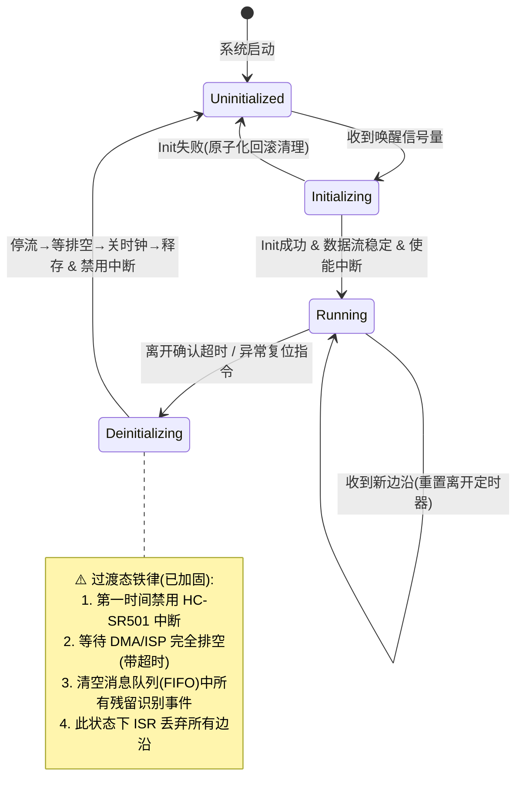

# 开发手册

## 1. 固件开发

### 1.1 pal层开发

PAL（Platform Abstraction Layer）是平台屏蔽层，封装 ESP-IDF SDK 的外设原语，向上提供统一接口。**PAL 允许透传 SDK 错误码（`esp_err_t` 兼容的 `int`）**——错误码翻译发生在 BSP 边界，PAL 只做封装不做翻译。

#### 1.1.1 目录与命名

```
components/pal/
├── pal_gpio/        # GPIO（含外部中断）
├── pal_i2c/         # I2C 主机总线 + 设备
├── pal_spi/
├── pal_i2s/         # I2S 标准 Philips 模式
├── pal_mipi_dsi/    # MIPI DSI + DPI 面板
├── pal_cam/         # MIPI CSI 摄像头（esp_video/V4L2 封装）
├── pal_sdmmc/       # SDMMC + FAT 挂载
├── pal_ledc/        # LEDC PWM
├── pal_ldo/         # LDO 电源
├── pal_uart/
├── pal_wdt/         # 看门狗
└── pal_log/         # 日志宏（封装 ESP_LOG）
```

- 模块名：`pal_<peripheral>`
- 函数名：`pal_<peripheral>_<verb><noun>()`，如 `pal_gpio_write()`
- 句柄类型：`pal_<peripheral>_handle_t`（不透明 `void *`）
- 配置结构体：`pal_<peripheral>_config_t`
- 头文件保护：`#ifndef PAL_XXX_H`

#### 1.1.2 接口约定

- 所有函数返回 `int`：`0` 成功，负数为 `esp_err_t` 兼容错误码（**不翻译**，由 BSP 边界翻译）。
- 句柄经 init 输出参数返回：`int pal_xxx_init(pal_xxx_handle_t *handle, const pal_xxx_config_t *cfg)`。
- ISR 回调运行在中断上下文，仅做信号量/队列投递，禁止阻塞、printf、内存操作（见 1.6.4 中断铁律）。
- 复杂硬件配置（时序、引脚复用）封装在 config 结构体，由 BSP 填充。

#### 1.1.3 开发流程

1. 数据手册/参考手册关键点摘要（注释中注明 TRM 章节）
2. 定义 config 结构体与不透明句柄
3. 实现 init/deinit/read/write，加错误返回
4. ISR 相关接口提供 install_isr_service / set_intr / enable / disable
5. PAL 层 host 单元测试（如 `test_pal_gpio.c`，mock SDK 头）

> PAL 层是平台相关的薄封装，**不包含业务逻辑、不感知多设备实例**。多设备管理由 DAL 负责。

### 1.2 osal层开发

OSAL（OS Abstraction Layer）封装 RTOS（FreeRTOS）接口，向上提供 `osal_xxx` 统一 API，便于在 FreeRTOS/裸机/Host 间移植。

#### 1.2.1 模块清单

| 模块 | 接口 | FreeRTOS 后端 |
|------|------|--------------|
| `osal_task` | task_create/delete/delay_ms | xTaskCreate/vTaskDelay |
| `osal_mutex` | mutex_create/lock/unlock/delete | xSemaphoreCreateMutex |
| `osal_semaphore` | sem_create_binary/take/give/delete | xSemaphoreCreateBinary |
| `osal_queue` | queue_create/send/receive/delete | xQueueCreate/Send/Receive |
| `osal_timer` | timer_create/start/stop/delete | xTimerCreate |
| `osal_memory` | malloc_caps/calloc_caps（PSRAM/DMA 能力） | heap_caps_malloc |

#### 1.2.2 关键约定

- **超时参数统一为 `uint32_t timeout_ms`**，`0`=不等待。⚠️ OSAL 内部用 `pdMS_TO_TICKS(timeout_ms)`，**不可传 `portMAX_DELAY`**（会溢出为小值）。永久等待用有限大超时（如 `UINT32_MAX` 仍溢出，故用 `3600*1000` 循环）或业务层信号量循环。
- 句柄为不透明 `void *`（mutex/sem/queue/timer）或 `osal_task_handle_t`。
- `osal_queue_send/receive` 为阻塞式（带超时），**非 ISR 安全**。ISR 中投递需用 FreeRTOS `FromISR` API（BSP 层直接调用，如 PIR 任务）。
- Host 单元测试提供 mock `osal_mutex.h`/`osal_task.h`/`osal_queue.h`（空操作/FFF fake），使 DAL/middleware 可脱离 RTOS 测试。

> OSAL 是 RTOS 的薄抽象，**不包含业务逻辑**。所有跨任务同步原语经 OSAL 而非直接调 FreeRTOS（PIR 因需 ISR 专用 API 例外，已在代码注释说明）。


### 1.3 bsp层开发

BSP（Board Support Package）是板级适配层。针对具体板卡，组合 PAL 原语驱动真实芯片，实现 DAL ops 契约，并**自注册**到 DAL。仅 BSP 知道引脚号、I2C 地址、芯片型号、时序参数。

#### 1.3.1 目录与结构

```
components/bsp/
├── bsp_config/include/bsp_config.h   # 全板引脚/参数宏（唯一配置源）
├── board_v1/                          # 板级编排：共享总线 + 按序 init
├── bsp_relay/                         # 单芯片：GPIO 继电器
├── bsp_display_rpi7pin/               # 多芯片：tc358762(子) + attiny88(子) + rpi7pin(组装器)
├── bsp_camera_ov5647/
├── bsp_touch_ft5406/
├── bsp_audio_es8311/                  # codec(子) + es8311(组装器)
├── bsp_network_ip101/
├── bsp_pir_hcsr501/
└── bsp_storage_sdmmc/
```

- 单芯片 BSP：`bsp_xxx.c` + `include/bsp_xxx.h`
- 多芯片 BSP：子芯片驱动 `.c/.h` 放组件根（**不放入 include/**，仅组装器可见）+ 组装器 `bsp_xxx.c` + `include/bsp_xxx.h`
- 子芯片头不对外：仅本 BSP 组装器 `#include`

#### 1.3.2 开发范式（自注册）

1. 在 `bsp_config.h` 定义引脚/参数宏（`BOARD_XXX_*`）
2. 实现子芯片驱动（私有 ctx + 寄存器序列），错误码经 `dal_err_from_pal()` 翻译为 `dal_err_t`
3. 组装器实现 `dal_xxx_ops_t` 各回调，分发到子芯片
4. `bsp_xxx_init(void)` 内：硬件初始化 → 调 `dal_xxx_register(name, &ops, &ctx)` 自注册
5. 返回 `dal_err_t`，`@retval` 标注 `DAL_ERR_*`

```c
dal_err_t bsp_xxx_init(void)
{
    /* 1. 硬件初始化（PAL 原语，参数取自 bsp_config.h） */
    /* 2. 错误码翻译：PAL int → dal_err_t */
    /* 3. 自注册到 DAL */
    return dal_xxx_register("main_xxx", &s_ops, &s_ctx);
}
```

#### 1.3.3 关键约束

- **错误码隔离**：BSP ops 边界必须翻译 PAL/SDK 错误码为 `dal_err_t`，原始码不透传到 DAL/Service。用 `dal_err_from_pal()`（`dal_pal_err.h`）公共翻译，或自写翻译函数。
- **共享总线**：多设备共用 I2C/SPI 总线时，由 `board_v1` 统一初始化并暴露 `board_i2c_get_bus()`，BSP 内部获取句柄，**禁止各 BSP 重复 init 总线**。
- **引脚唯一来源**：所有引脚号、I2C 地址、时序参数取自 `bsp_config.h` 宏，BSP 内部不硬编码（relay 因历史原因硬编码，待迁移）。
- **多芯片上电序列**：严格按数据手册顺序（如 display：DSI init → attiny88 power_on → release_reset → tc358762 config_bridge → 背光）。
- **ISR 处理**：BSP 内部 ISR 仅投信号量，复杂逻辑推迟到 BSP 内部任务（如 PIR：ISR `xSemaphoreGiveFromISR` → 任务读电平调回调）。

#### 1.3.4 board_v1 编排

`board_v1_init()` 按依赖顺序调用各 `bsp_xxx_init()`（触发自注册），顺序：
```
I2C 总线 → storage → display → camera → touch → relay → audio → network → pir
```
任一失败告警但不中止（返回 bool），已初始化部分保留。


### 1.4 dal层开发

DAL（Device Abstraction Layer）定义纯业务语义接口契约 + 设备注册表管理。不依赖任何 BSP，不感知芯片型号。

#### 1.4.1 三件套结构

每个设备类型一组三件套：
```
components/dal/dal_xxx/
├── include/
│   ├── dal_xxx_interface.h   # 接口契约（纯业务语义，Service 可含）
│   └── dal_xxx.h             # 管理 API（register/get，仅 BSP/main 可含）
└── dal_xxx.c                 # 管理实现（基于 dal_registry）
```

- **interface.h**：定义 `dal_xxx_config_t`（纯业务，无引脚/时序）、`dal_xxx_ops_t`（函数指针契约）、便捷宏。**严禁** `#include` 任何平台头（`pal_*.h`/`driver/*.h`）或管理头。所有硬件上下文封装为 `void *ctx`。
- **.h（管理）**：`dal_xxx_register(name, ops, ctx)` / `dal_xxx_get(name, &ops, &ctx)`。仅 BSP 与 main(Assembler) 可含，Service 禁止。
- **.c**：基于 `dal_registry` 公共注册表实现，懒初始化。

#### 1.4.2 公共基础设施（dal/common/）

```
components/dal/common/
├── include/
│   ├── dal_err.h          # dal_err_t 统一错误码
│   ├── dal_registry.h     # 泛型注册表
│   └── dal_pal_err.h      # dal_err_from_pal() 翻译（static inline）
└── dal_registry.c         # 注册表实现（osal_mutex 保护，原子 get）
```

- **`dal_err_t`**：DAL/SVC 唯一错误码（`DAL_OK`/`DAL_ERR_INVALID`/`NO_MEM`/`NOT_FOUND`/`BUSY`/`TIMEOUT`/`HW`/`STATE`/`UNSUPPORTED`）。0 成功负数失败。
- **`dal_registry`**：register/get 原子取 ops+ctx（同一临界区），重名返回 `DAL_ERR_STATE`，满返回 `DAL_ERR_NO_MEM`。各 `dal_xxx.c` 持一个静态 `dal_registry_t` + 静态 entry 数组。
- **`dal_err_from_pal()`**：BSP 边界翻译，`ESP_ERR_INVALID_ARG→DAL_ERR_INVALID` 等语义映射，其余→`DAL_ERR_HW`（不泄露原始码）。

#### 1.4.3 新增设备 DAL 流程

1. 写 `dal_xxx_interface.h`：纯业务 config + ops 契约（`void *ctx`，`dal_err_t` 返回）
2. 写 `dal_xxx.h`/`.c`：register/get 基于 dal_registry（拷贝 dal_display.c 模板改名）
3. 加 `dal/CMakeLists.txt` 的 SRCS + INCLUDE_DIRS
4. BSP 实现 ops 并自注册（见 1.3）
5. Service 经 `dal_xxx_get()` 取接口注入（见 1.6）

#### 1.4.4 接口防泄漏检查清单

- [ ] 接口参数无硬件枚举（`i2c_port_t`/`gpio_num_t`）
- [ ] 无硬件寄存器结构体指针
- [ ] 复杂配置已替换为纯业务结构体或 `void *`
- [ ] 返回值统一 `dal_err_t`，无底层码透传
- [ ] Service 编译不依赖 BSP/PAL 头

> ⚠️ Service 允许依赖 DAL **接口契约头**（`dal_xxx_interface.h`），禁止依赖 DAL **管理头**（`dal_xxx.h`）/BSP/PAL。两者不可混淆。


### 1.5 middleware层开发

Middleware 是与具体硬件无关的通用组件层，可被 Service 复用。位于 DAL/OSAL 之上，业务逻辑之下。

#### 1.5.1 目录与职责

```
components/middleware/
└── event_bus/              # 事件总线（业务任务间控制流 IPC）
    ├── include/
    │   ├── service_event.h # 统一事件类型定义
    │   └── mw_event_bus.h  # 发布/订阅 API
    └── mw_event_bus.c      # 实现（队列 + 分发任务）
```

后续可扩展：`buffer_pool`（计数型环形帧缓冲池）、`ann_index`（Faiss-lite 特征索引）、`ppa_scaler`（像素加速）等。

#### 1.5.2 事件总线（mw_event_bus）

业务任务间控制流通信的统一管道，实现**发布/订阅模型**：

- **发布方**：`mw_event_bus_publish(&evt)` 非阻塞入队（满返回 `DAL_ERR_BUSY`，发布方决策丢弃/重试）。
- **订阅方**：`mw_event_bus_subscribe(type, cb, user_data)` 注册回调；`type=SERVICE_EVT_NONE` 订阅全部。
- **分发任务**：内部常驻任务从队列取事件，遍历订阅表调匹配回调（回调运行在分发任务上下文，非 ISR，应简短；耗时操作转发到业务自有任务）。

```c
/* 订阅示例 */
static void on_auth(const service_event_t *e, void *ud) {
    if (e->type == SERVICE_EVT_AUTH_PASS) { /* 开门 */ }
}
mw_event_bus_subscribe(SERVICE_EVT_AUTH_PASS, on_auth, NULL);

/* 发布示例 */
service_event_t evt = { .type=SERVICE_EVT_AUTH_PASS, .source=SERVICE_SRC_USER_MANAGE, .arg0=pid };
mw_event_bus_publish(&evt);
```

#### 1.5.3 关键约定

- **事件载荷固定大小**（`service_event_t`），按值拷贝入队，避免动态内存。大块数据（帧/特征向量）经 `payload` 句柄零拷贝传递，所有权由具体事件约定。
- **ISR 安全**：`publish` 不可在 ISR 调用（`osal_queue_send` 非 FromISR）。ISR 投信号量由任务上下文转换后 publish。
- **线程安全**：publish/subscribe 用 osal_mutex 保护订阅表。
- **事件类型扩展**：新增类型仅在 `service_event.h` 枚举**末尾追加**，保持兼容。
- **容量**：队列深度 `MW_EVENT_BUS_QUEUE_DEPTH`（默认 32）、订阅者上限 `MW_EVENT_BUS_MAX_SUBSCRIBERS`（默认 16）可编译选项覆盖。

> 事件总线承载**控制流**（小型状态事件）。**数据流**（图像/特征向量）用共享内存 + 计数型缓冲池（`buffer_pool`，待实现），不走事件总线。


### 1.6 业务层开发

**底层基础业务划分**：

* **数据库管理任务**

  - **职责**：封装 SQLite/KV 存储引擎，提供线程安全的 CRUD 接口；管理 Flash 磨损均衡与掉电安全（WAL/双备份）；维护人员特征库、通行记录、系统配置的持久化。
  - **关键点**：作为独立服务运行，对外暴露语义化 API（如 `person_add()`, `record_query()`），**严禁**其他任务直接调用 `fopen/sqlite3_exec`。内部使用 Mutex + 消息队列串行化写操作，避免多任务竞争。
  - **优先级**：中低（避免阻塞识别主流程）。

  

* **日志管理任务**

  - **职责**：异步收集各模块日志，执行 RAM Buffer 环形缓存 + 批量落盘策略；支持日志分级过滤与远程上传队列。
  - **关键点**：采用**生产者-消费者模型**，业务层仅做非阻塞 `log_push()`，由本任务负责刷盘。防止 SD 卡/Flash 写入抖动影响人脸检测实时性。
  - **优先级**：最低（可被所有业务抢占）。

* **系统稳定性保障任务**

  - **职责**：硬件看门狗喂狗、任务心跳监测、内存/存储水位告警、异常状态自动恢复（如摄像头掉线重连、MQTT 断线重连）、OTA 状态机管理。

  - **关键点**：作为系统的“保险丝”，必须独立于核心业务。检测到关键任务超时未上报心跳时，执行分级复位策略。

  - **优先级**：高（确保监控不被业务卡死）。


**交互业务划分：**

- **UI 显示任务**
  - **职责**：LVGL框架渲染、界面状态机切换、摄像数据显示、识别结果反馈动画、离线/在线状态指示。
  - **关键点**：与 Touch 任务解耦，通过消息队列接收事件。帧率控制在 30fps 即可，避免过度占用 GPU/CPU。
  - **优先级**：中（保证用户交互流畅，但低于识别）。
- **Touch 坐标获取任务**
  - **职责**：触摸 IC 轮询或中断读取、坐标滤波去抖、手势识别、向 UI 任务发送标准化输入事件。
  - **关键点**：采样率 ≥ 60Hz，避免抖动误触。
  - **优先级**：中高（输入响应延迟 < 50ms）。

**核心业务划分：**

- **摄像数据采集任务**

  - **职责**：MIPI Camera 驱动管理、ISP 参数动态调整（宽动态/降噪）、计数型缓冲池管理、向UI显示任务与人脸检测任务零拷贝送帧。
  - **关键点**：使用 **DMA + 双/三缓冲**，杜绝丢帧。曝光/增益调节需与识别算法联动（如逆光场景自动切换 HDR）。
  - **优先级**：最高（数据源头，阻塞则全链路瘫痪）。

- **人脸检测任务**

  - **职责**：从帧缓冲取图、预处理（Resize/归一化）、运行检测模型、输出人脸框坐标与质量分。
  - **关键点**：绑定 NPU/DSP 加速单元；设置**质量阈值**过滤低质帧，减少后续无效计算；支持多尺度检测适配不同距离。
  - **优先级**：高（实时性瓶颈所在）。

- **人脸特征提取任务**

  - **职责**：对检测到的人脸裁剪对齐、运行特征提取模型、生成 512D/256D 特征向量。
  - **关键点**：与检测任务可**流水线并行**（检测第 N+1 帧时提取第 N 帧特征）；特征向量存入共享内存供识别任务使用。
  - **优先级**：高（与检测同级的计算密集任务）。

- **人脸识别任务**

  - **核心职责**：负责实时视频流的 1:N 识别流水线。包括特征向量提取、与本地底库的高速比对、活体检测判定，并输出标准化识别结果（PersonID + 置信度 + 质量分）。**仅输出“是谁”，不决定“做什么”**。

  - 关键工程约束

    ：

    - 底库 >1000 人时强制启用 ANN 索引加速（如 Faiss-lite），比对耗时目标 <100ms@5000人。
    - 支持底库热更新，动态增删特征向量时不中断识别流水线。
    - 与人员权限管理任务通过共享内存/零拷贝传递特征数据，杜绝内存搬运开销。

  - **优先级**：**高**。端到端延迟的关键环节，阻塞将导致全链路瘫痪。

- **人员权限管理任务**

  - 核心职责：作为 APP 层处理“人员是否允许开门”的唯一业务入口与领域聚合根。
    - **用户 CRUD**：统一管理用户、人脸、权限的生命周期，保证数据事务一致性。
    - **人脸录入**：封装“采集→质检→提取→入库”完整流程，调度 AI 能力并把控底库质量。
    - **单帧识别**：对外提供 `recognize_single()` 接口，封装 1:1/M:N 等模式，屏蔽底层 AI 差异。
    - **权限校验与决策**：接收实时识别结果或外部验证请求，结合时段、区域、黑名单等规则进行鉴权，**输出最终的开门/拒绝/报警决策**。

- 关键工程约束：
  - **纯业务逻辑任务**，不涉及 AI 模型推理计算。
  - 内部维护 RAM 权限缓存，CRUD 操作时同步更新，确保鉴权 O(1) 响应。
  - 开门信号输出前执行硬件级防抖与状态机校验。
  - 权限变更通过消息广播，无需重启识别流水线。
  - **MQTT 下行指令的唯一消费者**：负责解析云端透传的用户管理/远程开门 Payload，并执行验签、业务校验与落盘。
- **优先级**：**中**。允许 10~50ms 决策延迟，但不能阻塞识别流水线与 UI 交互。

#### 3. MQTT 任务

- **核心职责**：设备与云端交互的**纯通信管道**。负责连接生命周期管理、事件上报透传、远程命令路由分发、离线缓存补传。**绝不解析任何业务语义**。
- 关键工程约束：
  - **连接管理**：TLS 双向认证、心跳保活、断线重连（指数退避+随机抖动），重连异步执行不阻塞本地业务。
  - **消息路由**：下行指令按 Topic 前缀原样投递至对应业务任务（如 `cmd/user` → 人员权限管理任务），不做任何字段解析。
  - **QoS 分级**：心跳 QoS0；通行记录/告警/开门指令 QoS1；底库全量同步 QoS2。
  - **离线保障**：断网时关键事件写入 RAM RingBuffer / Flash 日志，写入零阻塞；联网后按优先级限流补传，携带全局唯一 `msg_id` 防重。
  - **本地隔离**：网络 IO 与业务逻辑完全解耦，网络异常时自动降级，确保本地识别与开门决策零影响。
- **优先级**：**中低**。网络波动与重连不应影响本地识别与开门决策。


#### 1.6.2 任务开发决策

| 决策维度         | 推荐方案                               | 备选/不推荐           | 核心理由                                                     |
| ---------------- | -------------------------------------- | --------------------- | ------------------------------------------------------------ |
| IPC 机制         | 消息队列（控制流）+ 共享内存（数据流） | 全局变量 / Socket     | 控制指令需有序可靠；图像/特征向量体积大，必须零拷贝避免 CPU 搬运开销。 |
| 任务调度模型     | 事件驱动 + 状态机                      | 裸循环轮询 / 阻塞等待 | 降低空闲功耗；避免单任务阻塞导致系统假死；适配多源异步输入（触摸、网络、AI结果）。 |
| 内存管理策略     | 静态分配 + 内存池                      | 动态 `malloc/free`    | 嵌入式长期运行严禁内存碎片；AI 帧缓冲、MQTT 离线缓存等大块内存启动时预分配。 |
| 错误处理范式     | 错误码 + 分级恢复                      | 断言 / 直接重启       | 非致命错误（如单次识别超时）重试或降级；致命错误（如 Flash 损坏）才触发看门狗复位。 |
| 配置持久化       | KV 存储（参数）+ SQLite（业务数据）    | 纯文件 / 纯数据库     | 系统参数读写频繁且体积小，KV 磨损均衡更优；人员/记录等结构化数据用 SQLite 保证事务一致性。 |
| AI 推理调度      | NPU 独占 + 异步回调                    | CPU 软推理 / 同步阻塞 | NPU 硬件加速是实时性前提；异步回调释放 CPU 给其他任务做预处理/后处理，实现流水线并行。 |
| 跨任务数据所有权 | 单一 Owner + 只读共享                  | 多任务可写            | 权限缓存仅“人员权限管理任务”可写，其他任务只读；杜绝竞态条件与脏数据。 |


#### 1.6.3 **关键流程图/时序图/数据流图**

* 实时识别-决策-执行数据流

```
[Camera] ──DMA──▶ [帧缓冲(Ring)] 
                      │
          ┌───────────┴───────────┐
          ▼                       ▼
[人脸检测(NPU)]            [UI显示(30fps)]
          │
          ▼ (人脸框+质量分)
[特征提取(NPU)] ──共享内存──▶ [人脸识别(ANN比对)]
                                      │
                                      ▼ (PersonID+置信度)
                              [人员权限管理] ◀── [RAM权限缓存]
                                      │
                              ┌───────┴───────┐
                              ▼               ▼
                        [IO执行(开门)]   [MQTT(事件上报)]
                        (防抖+状态机)    (异步透传,零解析)
```

> **数据流关键点**：
>
> - 图像数据全程 DMA + 零拷贝，CPU 仅传递元数据（坐标、指针、长度）。
> - 识别结果到权限决策为进程内消息队列传递，延迟 <1ms。
> - MQTT 仅接收“已组装好的事件报文”，不参与任何业务字段拼接。

* 云端远程开门指令时序

```
Cloud        MQTT任务         人员权限管理任务      IO执行任务       DB任务
  │              │                  │                 │              │
  │─cmd/user(QoS1)─▶│               │                 │              │
  │              │─原样Payload投递─▶  │                 │              │
  │              │                  │─验签+解析JSON     │              │
  │              │                  │─查RAM权限缓存     │              │
  │              │                  │─生成开门决策      │              │
  │              │                  │──开门信号(防抖)──▶│              │
  │              │                  │                 │─驱动继电器   │
  │              │                  │──记录通行事件──────────────────▶ │
  │              │                  │                 │            │─异步落盘
  │              │◀─ACK(QoS1)────── │                 │              │
  │◀─PUBACK──────│                  │                 │              │
```

> **时序关键点**：
>
> - MQTT 任务从收到消息到投递耗时 <5ms，不做任何业务处理。
> - 人员权限管理任务是唯一解析 Payload、校验权限、输出决策的节点。
> - DB 写入完全异步，不在开门关键路径上，确保端到端延迟可控。

* 系统架构图（LR）

  **核心机制**：

  - **空闲信号量（Empty Sem）**：计数 = N（总池大小），表示空闲可用的Buffer数量。
  - **就绪信号量（Full Sem）**：计数 = 0，表示已填充好、待识别的帧数量。
  - **采集任务**：阻塞`Take`空闲信号量 → 填充帧 → `Give`就绪信号量。
  - **识别任务**：阻塞`Take`就绪信号量 → 拷贝ROI/识别 → `Give`空闲信号量（归还）。

```mermaid
flowchart LR
    subgraph Hardware_Interrupt [硬件中断层]
        A[HC-SR501 上升沿 ISR] -->|仅发信号量| B(采集任务)
    end

    subgraph Task_Layer [RTOS 任务层]
        B -->|状态变更事件 EVT_CAM_STATE| C{状态广播}
        
        B -->|1. Take(Empty_Sem) 获取空闲槽<br/>2. 写入帧数据<br/>3. Give(Full_Sem) 递送就绪帧| D[识别任务]
        
        C -->|STATE_RUNNING / SUSPENDED| E[UI 显示服务]
        D -->|识别结果事件 EVT_RECOG_RESULT| F[消息队列]
        F -->|PASS / REJECT / ERROR| E
    end

    subgraph Resource_Layer [资源管理层]
        G[(计数型环形帧缓冲池<br/>总容量 N 槽位)]
        H[Empty_Sem 空闲计数=N<br/>Full_Sem 就绪计数=0] -.->|驱动采集与识别同步| B
        H -.->|驱动采集与识别同步| D
        I[外设驱动 API] -.->|Init/Deinit| B
    end
    
    style Hardware_Interrupt fill:#ffe0b2,stroke:#f57c00
    style Task_Layer fill:#e1f5fe,stroke:#0288d1
    style Resource_Layer fill:#f3e5f5,stroke:#7b1fa2
```


* 设备状态机（StateDiagram）




* 识别流水线（TD）

```MERMAID
flowchart TD
    A["阻塞等待 Full_Sem\n从就绪队列获取帧缓冲槽位"] --> B[人脸检测模块]
    B --> C{检测到人脸?}
    
    C -- 否 --> D["释放当前槽位回空闲池\nGive Empty_Sem"]
    C -- 是 --> E["提取特征值 & 权限校验"]
    
    E --> F{校验结果?}
    F -- 通过 --> G[生成 PASS 事件]
    F -- 拒绝 --> H[生成 REJECT 事件]
    F -- 异常 --> I[生成 ERROR 事件]
    
    G --> J["释放帧缓冲槽位回空闲池\nGive Empty_Sem & 推送结果至队列"]
    H --> J
    I --> J
    
    D --> K["阻塞等待下一帧就绪信号\n继续 Take Full_Sem"]
```


* UI显示服务（TD）

  **优化点**：引入 **“结果驻留锁（Holding Lock）”**。在 2~3s 驻留期间，新来的识别结果**不再重置定时器**（仅静默更新后台数据或直接丢弃），定时器超时后自动释放锁，彻底解决高并发人流下提示层无法清除的顽疾。

```MERMAID
flowchart TD
    A[订阅 EVT_CAM_STATE & EVT_RECOG_RESULT] --> B{当前界面状态?}
    
    B -- 待机态 --> C[忽略识别事件<br/>仅响应 STATE_RUNNING]
    C -->|收到 RUNNING| D[切换至采集预览界面<br/>复位驻留锁标志]
    
    B -- 采集态 --> E{驻留锁是否激活?}
    E -- 是 --> F[忽略新识别结果<br/>维持当前提示画面<br/>（定时器继续倒计时）]
    
    E -- 否 --> G{接收到的事件类型?}
    G -- STATE_SUSPENDED --> H[立即清除提示层<br/>切回待机界面<br/>复位驻留锁]
    G -- PASS --> I[渲染绿色通行 + 用户信息]
    G -- REJECT --> J[渲染红色警告提示]
    G -- ERROR --> K[渲染系统异常提示]
    
    I --> L[激活驻留锁<br/>启动 UI 结果驻留定时器 2~3s]
    J --> L
    K --> L
    
    L --> M{定时器超时 OR<br/>收到 STATE_SUSPENDED?}
    M -- 是 --> N[清除提示层<br/>复位驻留锁<br/>恢复纯采集预览]
    M -- 否 --> O[保持当前提示画面<br/>继续等待超时]
    
    O --> F
    N --> D
    H --> C
    F --> A
```


### 1.6.4 中断管理

| 中断源            | 优先级 | 处理策略                                                     | 禁止事项                                                     | 关联任务              |
| ----------------- | ------ | ------------------------------------------------------------ | ------------------------------------------------------------ | --------------------- |
| HC-SR501 OUT 引脚 | 中高   | 上升沿： ① 若采集任务处于挂起态 → 唤醒任务启动采集； ② 若离开确认定时器正在运行 → 立即取消定时器，保持采集运行； 下降沿： 启动/重置“离开确认定时器”（默认 5~10s），不直接挂起任务； ISR 仅做边沿到动作的映射，不传递数据、不记录时间戳 | 禁止在 ISR 中做去抖、延时、内存操作、日志打印、向 UI/权限任务发送事件、控制屏幕背光、直接挂起任务 | 摄像数据采集任务      |
| Timer Tick        | 系统级 | 仅更新系统时基、喂软件看门狗计数器                           | 禁止绑定任何业务逻辑                                         | OSAL / 稳定性保障任务 |

#### ⚠️ 中断设计铁律

1. **ISR 只做“搬运工”和“信号员”**：所有中断服务程序执行时间必须 <10μs（Camera/NPU 等高频中断 <5μs），复杂逻辑一律推迟到任务上下文。
2. **共享数据保护**：ISR 与任务共享的变量必须用 `volatile` 修饰；多字节数据使用原子操作或关中断保护，禁用 Mutex（ISR 中不可阻塞）。
3. **中断嵌套管控**：仅允许 Camera VSYNC 抢占 NPU 完成中断；其余中断同级不嵌套，避免栈溢出与优先级反转。
4. **异常隔离**：外设中断异常（如 UART 溢出、DMA 错误）不得触发系统复位，由对应任务记录错误计数并尝试自恢复；仅硬件级致命故障（如电压跌落）才走硬件看门狗复位路径。
5. **调试友好**：所有 ISR 入口/出口预留 GPIO 翻转探针点，便于示波器实测中断延迟与执行时长，验证是否满足实时性约束。